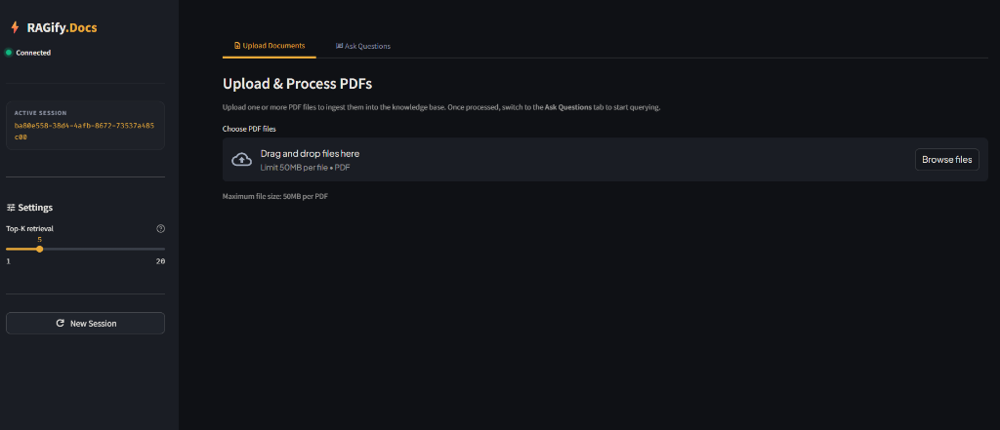
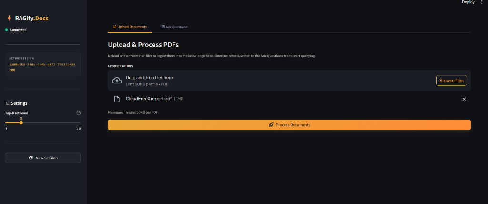
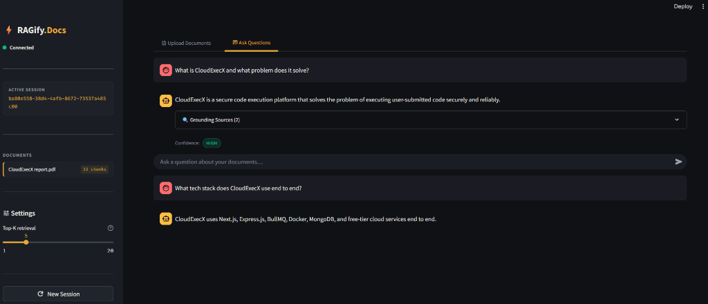
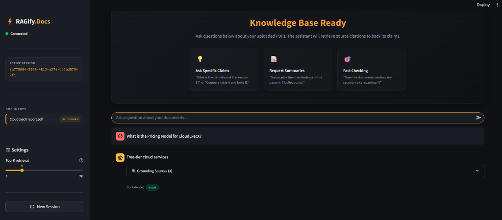
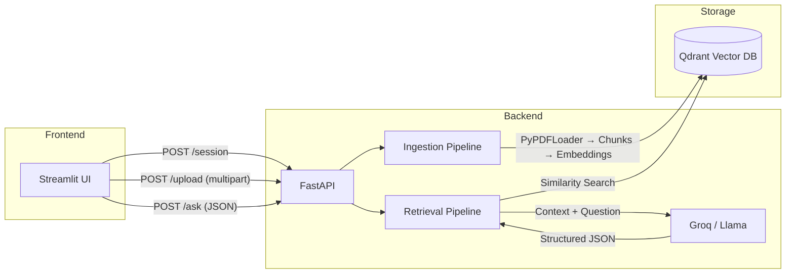

# 📄 RAGify-Docs

**RAG-powered PDF Q&A system.** Upload PDFs, ask questions in plain English, and get answers grounded strictly in your documents - every answer comes with a citation (source PDF + page number), so you can verify it yourself instead of taking the model's word for it.


## Table of Contents

- [Features](#features)
- [Screenshots](#screenshots)
- [Architecture](#architecture)
- [Prerequisites](#prerequisites)
- [Quick Start](#quick-start)
- [API Endpoints](#api-endpoints)
- [Configuration Reference](#configuration-reference)
- [Project Structure](#project-structure)
- [Troubleshooting](#troubleshooting)
- [Roadmap](#roadmap)
- [License](#license)

## Features

- 🔍 **Grounded answers only** - responses are built strictly from retrieved chunks, not the model's general knowledge
- 📎 **Citations on every answer** - source filename, page number, and a text snippet for verification
- 🗂️ **Isolated sessions** - each session gets its own Qdrant collection, so documents never bleed across users
- ♻️ **Smart re-uploads** - re-uploading a file with the same name replaces its old chunks instead of duplicating them
- 🛡️ **Resilient LLM parsing** - a 3-tier fallback (JSON mode -> reprompt -> graceful degradation) keeps structured output reliable even when the model misbehaves

## Screenshots

### Upload Documents Tab


### Document Ready for Processing


### Chat – Follow-up Question 1


### Chat – Follow-up Question 2


## Architecture



### Key Design Decisions

| Area                      | Decision                                                                                                                            |
| ------------------------- | ----------------------------------------------------------------------------------------------------------------------------------- |
| **Session isolation**     | Each session gets its own Qdrant collection (`ragify_<uuid>`)                                                                       |
| **Embedding dimension**   | Derived dynamically from the model at startup - no hardcoded values                                                                 |
| **Qdrant integration**    | Collection lifecycle via `qdrant-client` directly; document operations via `QdrantVectorStore` constructor (never `from_documents`) |
| **Duplicate uploads**     | Overwrite strategy - old chunks with the same filename are deleted before re-ingesting                                              |
| **LLM structured output** | 3-tier fallback: JSON mode -> retry-with-reprompt -> graceful degradation                                                           |
| **Page numbers**          | Converted from PyPDFLoader's 0-indexed to 1-indexed                                                                                 |

## Prerequisites

- **Python 3.11+**
- **Groq API Key** ([get one here](https://console.groq.com/))
- **Qdrant Cloud account & API key** ([get one here](https://cloud.qdrant.io/)) - or run Qdrant locally via Docker (see [Troubleshooting](#troubleshooting))

## Quick Start

### 1. Clone & enter the project

```bash
git clone https://github.com/RishiBuilds/RAGify-Docs.git
cd RAGify-Docs
```

### 2. Configure environment

```bash
cp .env.example .env
```

Edit `.env` and set:

```
GROQ_API_KEY=your-actual-groq-key-here
QDRANT_URL=your-qdrant-url-here
QDRANT_API_KEY=your-actual-qdrant-key-here
```

Other settings have sensible defaults - see the [Configuration Reference](#configuration-reference) below.

### 3. Install & start the backend

```bash
cd backend
python -m venv venv
venv\Scripts\activate        # Windows
# source venv/bin/activate   # macOS/Linux

pip install -r requirements.txt
uvicorn app.main:app --reload --host 0.0.0.0 --port 8000
```

API docs available at `http://localhost:8000/docs`.

### 4. Install & start the frontend

Open a new terminal:

```bash
cd frontend
pip install -r requirements.txt
streamlit run app.py
```

Open `http://localhost:8501` in your browser.

## API Endpoints

| Method   | Endpoint                | Description                              | Body                                                         |
| -------- | ----------------------- | ---------------------------------------- | ------------------------------------------------------------ |
| `GET`    | `/health`               | Health check (pings Qdrant)              | N/A                                                          |
| `POST`   | `/session`              | Create a new session + Qdrant collection | N/A                                                          |
| `DELETE` | `/session/{session_id}` | Delete session's collection              | N/A                                                          |
| `POST`   | `/upload`               | Upload & ingest PDFs                     | `multipart/form-data`: `session_id` (field) + `files` (PDFs) |
| `POST`   | `/ask`                  | Ask a question                           | `JSON`: `{"session_id": "...", "question": "..."}`           |

### Example: Ask a question

```bash
curl -X POST http://localhost:8000/ask \
  -H "Content-Type: application/json" \
  -d '{"session_id": "YOUR_SESSION_ID", "question": "What is the main conclusion?"}'
```

Response:

```json
{
  "answer": "The main conclusion is...",
  "sources": [
    {
      "filename": "report.pdf",
      "page_number": 12,
      "snippet": "In conclusion, the study demonstrates..."
    }
  ],
  "confidence": "high"
}
```

## Configuration Reference

All values are set via environment variables or `.env`:

| Variable               | Default                                  | Description                          |
| ---------------------- | ---------------------------------------- | ------------------------------------ |
| `QDRANT_URL`           | `http://localhost:6333`                  | Qdrant server URL                    |
| `QDRANT_API_KEY`       | (empty)                                  | Qdrant API key (for Qdrant Cloud)    |
| `HF_EMBEDDING_MODEL`   | `sentence-transformers/all-MiniLM-L6-v2` | HuggingFace embedding model          |
| `GROQ_API_KEY`         | (required)                               | Groq API key                         |
| `GROQ_BASE_URL`        | `https://api.groq.com/openai/v1`         | Groq endpoint                        |
| `GROQ_MODEL`           | `llama-3.1-8b-instant`                   | Groq model name                      |
| `CHUNK_SIZE`           | `600`                                    | Text splitter chunk size             |
| `CHUNK_OVERLAP`        | `120`                                    | Text splitter overlap                |
| `TOP_K`                | `5`                                      | Default number of chunks to retrieve |
| `MAX_FILE_SIZE_MB`     | `10`                                     | Max file size per upload             |
| `MAX_FILES_PER_UPLOAD` | `10`                                     | Max files per request                |
| `FRONTEND_ORIGIN`      | `http://localhost:8501`                  | CORS allowed origin                  |
| `SNIPPET_MAX_LENGTH`   | `200`                                    | Max snippet length in citations      |

## Project Structure

```
RAGify-Docs/
├── backend/
│   ├── app/
│   │   ├── main.py              # FastAPI app + CORS + lifespan
│   │   ├── config.py            # pydantic-settings
│   │   ├── schemas.py           # Pydantic request/response models
│   │   ├── routes/
│   │   │   ├── health.py        # GET /health
│   │   │   ├── session.py       # POST/DELETE /session
│   │   │   ├── upload.py        # POST /upload
│   │   │   └── ask.py           # POST /ask
│   │   ├── services/
│   │   │   ├── embedding.py     # HuggingFace embedding singleton
│   │   │   ├── vectorstore.py   # Qdrant client + vectorstore factory
│   │   │   ├── session_manager.py  # Session/collection lifecycle
│   │   │   ├── ingestion.py     # PDF → chunks → Qdrant
│   │   │   ├── retrieval.py     # Question → search → LLM
│   │   │   └── llm_client.py    # Groq wrapper (3-tier fallback)
│   │   └── utils/
│   │       └── sanitize.py      # Collection name sanitization
│   └── requirements.txt
├── frontend/
│   ├── app.py                   # Streamlit application
│   └── requirements.txt
├── .env.example
├── .gitignore
└── README.md
```

## Troubleshooting

**Running Qdrant locally instead of Qdrant Cloud**

```bash
docker run -p 6333:6333 qdrant/qdrant
```

Then set `QDRANT_URL=http://localhost:6333` and leave `QDRANT_API_KEY` empty.

**`/ask` returns low-confidence or empty answers**
Usually means retrieval didn't find relevant chunks. Try increasing `TOP_K`, or check that the PDF ingested cleanly (scanned/image-only PDFs won't extract text without OCR).

**CORS errors from the frontend**
Confirm `FRONTEND_ORIGIN` in `.env` matches the URL Streamlit is actually running on.

**Groq rate limits / 429s**
The free tier has strict rate limits - check the [Groq console](https://console.groq.com/) for current limits, or switch `GROQ_MODEL` to a lighter model.

## Roadmap

- [ ] TTL-based session cleanup (auto-delete abandoned sessions)
- [ ] Streaming LLM responses
- [ ] Multi-user authentication
- [ ] Concurrent upload locking (per-filename within a session)
- [ ] Hybrid retrieval (dense + sparse)
- [ ] Real confidence scoring (cross-reference cited pages with retrieved set)

## License

MIT
